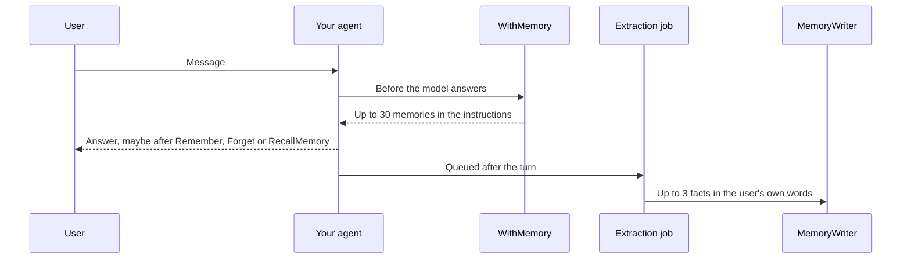
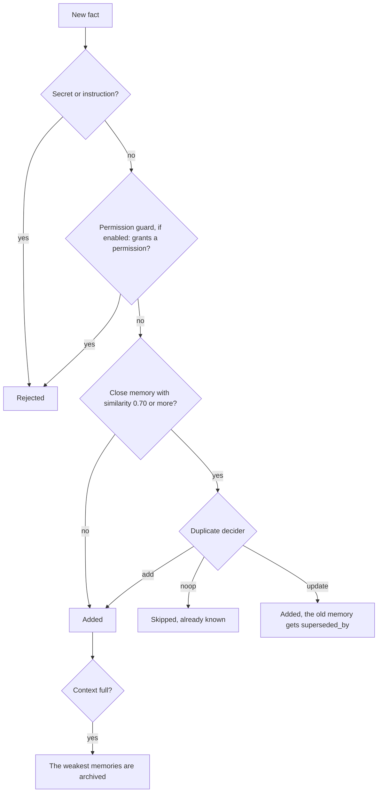

# How it works

```mermaid
sequenceDiagram
    participant U as User
    participant A as Your agent
    participant M as WithMemory
    participant Q as Extraction job
    participant W as MemoryWriter
    U->>A: Message
    A->>M: Before the model answers
    M-->>A: Up to 30 memories in the instructions
    A-->>U: Answer, maybe after Remember, Forget or RecallMemory
    A->>Q: Queued after the turn
    Q->>W: Up to 3 facts in the user's own words
```

Every fact, from the job or from `Remember`, goes through the writer:

```mermaid
flowchart TD
    F[New fact] --> S{Secret or instruction?}
    S -- yes --> R[Rejected]
    S -- no --> P{Permission guard, if enabled: grants a permission?}
    P -- yes --> R
    P -- no --> C{Close memory with similarity 0.70 or more?}
    C -- no --> ADD[Added]
    C -- yes --> D{Duplicate decider}
    D -- noop --> K[Skipped, already known]
    D -- update --> U[Added, the old memory gets superseded_by]
    D -- add --> ADD
    ADD --> FULL{Context full?}
    FULL -- yes --> AR[The weakest memories are archived]
```

Unused memories fade, and the weekly job merges and archives them. Only people delete.
